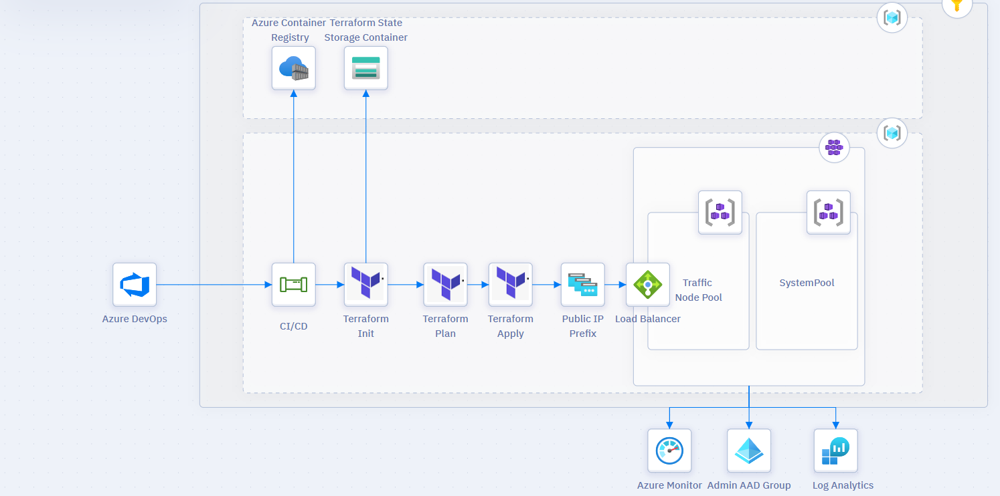

# Azure DevOps Assignment


----

This Repository was created based on the Azure DevOps Assignment.

The aim of the project is to dynamically create an environment using terraform and deploy the spring-react application in the repository.

The project was carried out by following 2 different methods. The only difference between them is that there is a Release Pipeline in two-pipeline-deployment and the Infrastructure-as-Code part is implemented in the release pipeline.

Although the second method is more correct for me, I wanted to do it with two different methods.

The architect of the project was considered as follows;



Services used in the whole project are as follows;

- Azure Kubernetes Service
- Log Analytics Workspace
- Azure AAD Admin Group
- Azure Monitor
- Azure Storage
- Azure DevOps
- Azure Container Registry

----


# To import into your environment

### For ACR information in Azure-pipelines.yml files;

```
ACRLoginServer
ACRAdminUser
ACRAdminPassword
```
###### The above variables need to be added. It can be written as a pipeline variable or directly into the yaml file.

###### To use Terraform tasks;

```
backendServiceArm
backendAzureRmResourceGroupName
backendAzureRmStorageAccountName
backendAzureRmContainerName
backendAzureRmKey
```
###### Variables need to be assigned.

### In the Terraform/main.tf file;

```
  backend "azurerm" {
    resource_group_name  = ""
    storage_account_name = ""
    container_name       = ""
    key                  = ""
  }
```
###### It needs to be changed for state.

### In Terraform/development/variables.tfvars and Terraform/production/variables.tfvars;

```
client_id               = ""
client_secret           = ""
tenant_id               = ""
subscription_id         = ""
```
###### fields need to be changed. The relevant service principal must have owner authority in the subscription and must have authority over AAD.

### Finally, in the release pipeline

```
(organizationName)
(userName)
```
###### fields need to be changed. UserName should be changed to mail.
